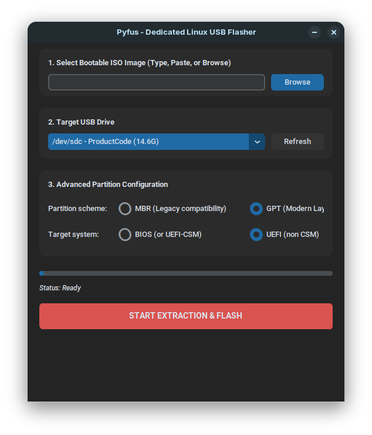

# Pyfus 



Pyfus is a lightweight, dedicated, high-speed Linux USB flasher designed to clone bootable ISO images directly onto raw hardware blocks. It features a modern dark-mode GUI driven by CustomTkinter, full block isolation routines to bypass system lock loops, and an optimized `dd` execution core.

##  Features
* **Zero Host Caching Lag:** Directly pipes data blocks into silicon memory layouts using optimized `oflag=direct,sync` pipelines.
* **Smart User Space Bridging:** Natively drops down permissions to trace your personal user spaces (`~/Downloads`, physical device sidebars) seamlessly under root execution profiles.
* **Advanced Layout Alignment:** Interoperates flawlessly with `parted` and `wipefs` architectures to map out clean MBR or GPT environments.

---

## Issues 
You tell me ;)

##  How to Install & Run

### Option 1: Standalone Binary (Recommended)
No Python or library installations required!
1. Head over to the **Releases** section on the right side of this page.
2. Download the pre-compiled `pyfus` binary asset.
3. Open your terminal in your downloads directory and run:
   ```bash
   chmod +x pyfus
   sudo ./pyfus
##  License
This project is open-source under the **MIT License**.
